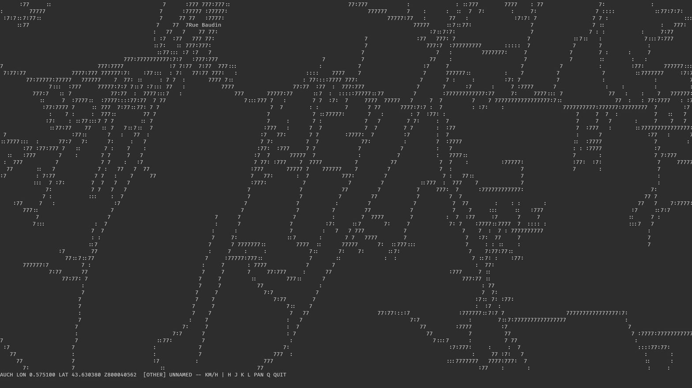

[agentic review instructions](AGENT-GUIDANCE.md)



# philae

`philae` is a viewport-based 2D map engine that renders live street-level geometry directly in your terminal as ASCII art. There is no libc, no windowing toolkit, and no external renderer: the whole program is x86-64 assembly talking to the Linux kernel through raw syscalls, rasterizing road geometry with a Bresenham line algorithm onto a character framebuffer.

## Vision

The long-term goal of philae is a fully 3D interactive visual map of the planet, with instant search and a virtual camera you can move anywhere to explore it live -- effectively turning the real world into a virtual, live-updated world. This terminal ASCII renderer is the current, first-slice implementation of that engine.

## Data

Map geometry comes from public geodata that is kept current by local authorities, so the underlying accuracy is absolute. Streets are pre-processed into compact fixed-point line segments and loaded once at startup; everything on screen is rendered live from that in-memory dataset.

## Controls

| Key       | Action                         |
|-----------|--------------------------------|
| `H` / `L` | Pan west / east                |
| `J` / `K` | Pan south / north               |
| `Q`       | Quit and restore the terminal  |

The status bar at the bottom of the screen shows the viewport center (longitude/latitude), zoom level, and, when the cursor sits over a road, its classification and speed limit.

## Build & run

```sh
./EXECUTE
```

`EXECUTE` assembles and links `master.ma` with GNU binutils and runs the resulting binary:

```sh
as -o /tmp/master.o master.ma && ld -e _start -o /tmp/master /tmp/master.o
/tmp/master
```

Build artifacts are written to `/tmp`, never into the repository.

## Requirements

- Linux, x86-64
- GNU binutils (`as`, `ld`)
- A TTY (the program takes over the terminal via raw mode and an alternate screen buffer)
